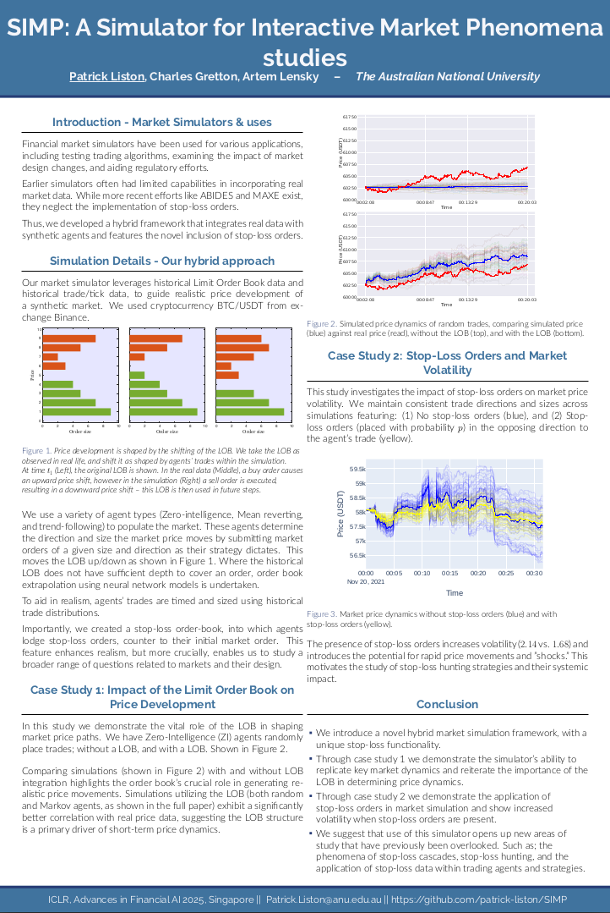

# SIMP
SIMP: A Simulator for Interactive Market Phenomena studies


# SIMP: A Simulator for Interactive Market Phenomena


### Overview 
[](Example_Output/SIMP_post_Image.png)

[](Example_Output/POSTER__ICLR_2025__SIMP__A_Simulator_for_Interactive_Market_Phenomena_studies.pdf)

### Exmaple Output (Expected upon first run)
[](Example_Output/Sample_Graph.png)


## Introduction

SIMP (A Simulator for Interactive Market Phenomena) is a novel hybrid financial market simulator developed by Patrick Liston, Charles Gretton, and Artem Lensky at The Australian National University. This simulator aims to bridge the gap between traditional simulators and real-world market dynamics by integrating historical Limit Order Book (LOB) and trade data with synthetic trading agents.

A key innovation of SIMP is the explicit implementation of a stop-loss order book. This inclusion allows for the study of a broader range of market phenomena and trading strategies.

This is part of work presented at 𝗜𝗖𝗟𝗥 𝟮𝟬𝟮𝟱 𝗪𝗼𝗿𝗸𝘀𝗵𝗼𝗽 𝗼𝗻 "𝗔𝗱𝘃𝗮𝗻𝗰𝗲𝘀 𝗶𝗻 𝗙𝗶𝗻𝗮𝗻𝗰𝗶𝗮𝗹 𝗔𝗜: 𝗢𝗽𝗽𝗼𝗿𝘁𝘂𝗻𝗶𝘁𝗶𝗲𝘀, 𝗜𝗻𝗻𝗼𝘃𝗮𝘁𝗶𝗼𝗻𝘀, 𝗮𝗻𝗱 𝗥𝗲𝘀𝗽𝗼𝗻𝘀𝗶𝗯𝗹𝗲 𝗔𝗜".

## Simulation Details

SIMP employs a hybrid approach to simulate market activity:

* **Real Data Integration:** The simulator utilizes historical LOB and trade/tick data for the BTC/USDT cryptocurrency from Binance to guide realistic price development.
* **Synthetic Agents:** The market is populated by various types of synthetic agents, including Zero-Intelligence (ZI), Mean Reverting, and Trend-Following agents. These agents generate market orders based on their strategies, influencing the LOB and consequently, price movements.
* **Limit Order Book Dynamics:** The simulator models the LOB, and price changes are a direct result of the execution of agents' market orders against the existing LOB. When the historical LOB lacks sufficient depth to fulfill an order, order book extrapolation is performed using neural network models.
* **Realistic Trade Timing and Sizing:** The timing and size of agents' trades are sampled from historical trade distributions, adding another layer of realism.
* **Novel Stop-Loss Order Book:** SIMP features a dedicated stop-loss order book. Agents can place stop-loss orders, which are triggered when the market price reaches a specified level, allowing for the simulation and analysis of stop-loss related phenomena.

## Case Studies

The paper accompanying SIMP presents two key case studies:

1.  **Impact of the Limit Order Book on Price Development:** This study demonstrates the crucial role of the LOB in generating realistic price movements by comparing simulations with and without LOB integration. The results show a significantly higher correlation with real price data when the LOB is incorporated.
2.  **Stop-Loss Orders and Market Volatility:** This study investigates the impact of stop-loss orders on market price volatility. Simulations with stop-loss orders exhibit increased volatility and the potential for rapid price shocks, highlighting the importance of studying stop-loss hunting strategies.

## Getting Started

### Prerequisites

* Julia (version compatible with the project dependencies)
* The necessary Julia packages as defined in the project files (e.g., `StatsBase`, `DataFrames`, `Random`). These will likely be installed automatically when running the scripts for the first time if you have a proper Julia environment setup.

### File Structure

The project directory (`SIMP_Upload`) contains the following files and directories:

```SIMP_Upload/
├── BTCUSDT_S_DEPTH/      # Directory containing historical LOB data
├── BTCUSDT_TRADES/     # Directory containing historical trade/tick data
├── Buy_Sell_Order_Execution.jl # Script for handling buy and sell order execution
├── Everything_Needed_to_Run_Sim.jl # Potentially contains setup and helper functions
├── Example_Output/        # Directory containing example output (graphs, poster)
│   ├── Sample_Graph.png
│   └── POSTER__ICLR_2025__SIMP__A_Simulator_for_Interactive_Market_Phenomena_studies.pdf
├── LOB_Extrapolation.jl  # Script for LOB extrapolation using neural networks
├── MAIN.jl                # The main script to run the simulation
└── MODELS/              # Directory containing neural network models for LOB extrapolation
```


## Installation

Describe here how to install dependencies and set up the environment to run the simulation.


### Running the Simulation

To run the main simulation script:

1.  Navigate to the `SIMP_Upload` directory in your Julia REPL (Read-Eval-Print Loop).
2.  Execute the `MAIN.jl` script:

    ```julia
    include("MAIN.jl")
    ```

    This will run the simulation based on the settings defined within `MAIN.jl`. You will see a progress bar indicating the simulation progress.

### Configuration

The `MAIN.jl` script contains several configurable parameters that you can adjust to modify the simulation:

```julia
plot_title = "test_plot"         # Title for the plot you create.
save_output_data = 1            # Set to 1 to save output data, 0 otherwise.
exp_name = "test_exp"           # Experiment name for output files.
MAIN_SAVE_PATH = MAIN_PATH * "/Data_Ouputs/" # Path for saving output data.
new_sim = 1                     # Toggle to 1 to run a new simulation, potentially 0 to load existing data (if implemented).
stop_loss_order = 0             # Set to 1 to enable stop-loss orders in the market, 0 to disable.

for num_sims in 1:2            # Number of simulations to run. Adjust as needed.
    # ... simulation loop ...
    seed_num = rand(1:10000)    # Random seed for reproducibility (can be fixed).
    # seed_num  = 1234
    Random.seed!(seed_num)
    # ... rest of the simulation setup ...
end
```


### Citing this Work
```@inproceedings{liston2025simp,
  title={SIMP: A Simulator for Interactive Market Phenomena},
  author={Liston, Patrick and Gretton, Charles and Lensky, Artem},
  booktitle={ICLR, Advances in Financial AI 2025},
  year={2025},
  address={Singapore}
}```
